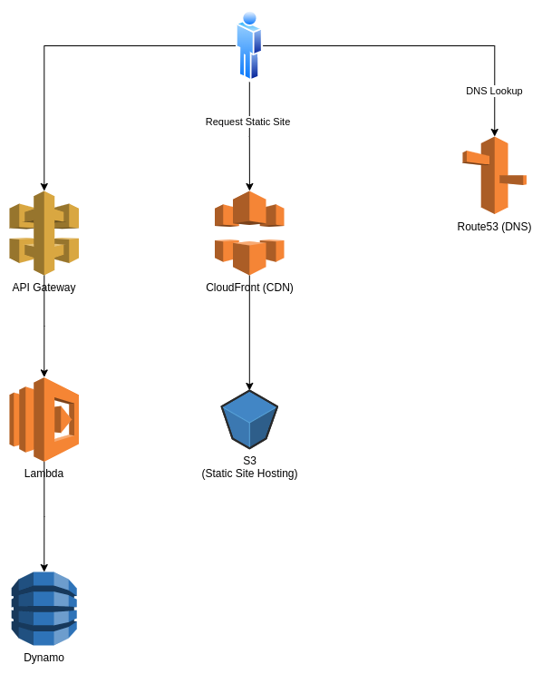

# GSD-AWS-CDK-Serverless-Example
[](https://github.com/chrishart0/gsd-aws-cdk-serverless-example/actions/workflows/CICD.yml)
[](https://github.com/chrishart0/gsd-aws-cdk-serverless-example/actions/workflows/codeql-analysis.yml)
[](https://codecov.io/gh/chrishart0/gsd-aws-cdk-serverless-example)

Live Demo: [awsdemo.chrishart.cloud](https://awsdemo.chrishart.cloud/)

Skips the reading and get right to the good stuff
## Why?
Local AWS development can be tough to get right, especially when it comes to local testing. This repo demonstrates how to easily use S3 for a static front end, Lambda + API Gateway for a logic tier, and DynamoDB for a persistance tier - all while still being able to easily test everything locally.

The best part? Initial setup only takes a few minutes, most of which is waiting for dependencies to install. You don't even need to configure anything to get started! (Assuming you have docker and docker-compose installed.)

This repo uses a pattern called [Three Musketeers](https://www.drewkhoury.com/post/gsd/3-musketeers-for-an-epic-developer-experience-8676ddaf33b2/), which provides for ease of setup and a better developer experience for this complicated local testing environment, with the added benefit of using the same local commands for the CI/CD.

# Overview

Deploys a 3 tier serverless app to AWS and allows for easy local testing and development. 



# First Time Use

**NOTE: None of this will work if you don't have an aws configuration file. (Which you won't if you've never made an aws config file on your machine)**
## How to create an AWS configuration file 
1. Log in to your AWS account and enter IAM.
2. In IAM, find your user, and click on the Security Credentials tab 
3. Under access Keys, create a new access key (!Make sure to securely store your credentials!)
4. Within your terminal install awscli (on MacOS, I utilized brew. So the command was brew install awscli)
5. Once awscli is installed, type the command "aws configure". It'll prompt you for the access credentials you just made. Optionally, you can enter the region as well. (I use us-east-1)
6. You now should have an aws configuration file on your machine 


# Setup
Ensure you have `docker`, `docker-compose`, and `make` installed. 
 
  AWS CLI : https://docs.aws.amazon.com/cli/latest/userguide/getting-started-install.html
  
  Docker: https://www.docker.com/
  
  Will need to install an Ubuntu shell if on windows. Ie WSL

  Pull the Repo into your local environment

## Configuration 

*You can skip this and go strait to start it up locally*

A prerequisite is you have a domain in AWS Route53.
In the root of this repo make a file called `configs.env` and fill it out as show below but replacing the example values.

If you don't know how to locate the hosted zone name or ID follow [this article](https://arcadian.cloud/aws/2022/03/22/how-to-find-hosted-zone-id-in-route53-aws-in-3-clicks/).

```
REACT_APP_DOMAIN=site.EXAMPLE.com
REACT_APP_HOSTED_ZONE_NAME=EXAMPLE.com
REACT_APP_HOSTED_ZONE_ID=123ASDFGH456AQWER34T4V1C
REACT_APP_USER_API_URL_LOCAL_SAM=http://localhost:3001/users
```

*Note: You should not have to change `REACT_APP_USER_API_URL_LOCAL_SAM` as the demo is designed to work on `localhost:3001`.*

## Start it up locally

Clone this repo down and `cd` into it.

`make install` - Install needed dependencies 

`make run` - This will start the react frontend, Lambda Backend, and DynamoDB

*Insert run and install gifs*

## Test it locally

`make test` - This will run a suite of test

`make test-frontend-interactive` - Starts up the jest test running in interactive mode, running `npm test` inside the container
*Insert testing gif*

`make test-e2e` - This will use playwright to run the end-to-end tests found in [e2e](./e2e/test.spec.ts)

**Tip:** Make sure to use `ctrl+c` when stopping any of the running commands so the containers exit gracefully

## Deploy
### `make diff`
Get a overview of what will be deployed

### `make deploy`

# More Details
## Working with the frontend
### Dependencies
3 Musketeers allows us to get away without installing Node or NPM locally but how do we manage dependencies? To get access to the full npm cli just run `make cli` and you are free to run any commands you wish.

#### Example: Adding a new dependency to the frontend
```
# Enter into the three musketeers container
$ make cli

# Install the new dependency
$ npm install --save-dev playwright

# Exit the Container
$ exit
```

## Testing
There are severl kinds of tests included in this repo:
* [End-to-end](infrastructure/test/infrastructure.test.ts)
* [Frontend Unit Tests](frontend/src/App.test.js)
* [AWS CDK Infrastructure Unit Tests:](infrastructure/test/infrastructure.test.ts) find docs [here](https://docs.aws.amazon.com/cdk/v2/guide/testing.html)
* [Backend Unit Tests](backend/tests/unit/test_handler.py)

`make lint` - Runs all linters: Currently only frontend

`make test` - Run all tests: currently - frontend unit/linter, backend unit, infra unit, and e2e

`make test-frontend` - Runs `npm test` in CI mode, which simply outputs the results of the tests once.

`make test-frontend-interactive` - Starts up the jest test running in interactive mode, running `npm test` inside the container

### End to End Testing

`make test-e2e` - Run e2e tests inside a container headless

`_test-install-e2e-headful` - Install needed pre-reqs for running headful e2e tests locally

`_test-e2e-headful` - Run headful e2e tests locally

### Building

`make build` - Standard `npm run build` command

`make ci` - Uses npm ci, which is the prefered build command for us in CI pipelines, as it is faster and more stable. 

## Deploying

* Ensure the config.env file is configured
* Run `make diff` and review the changes
* Run `make deploy`

Note: Each time you run `make deploy` the frontend will be rebuilt and redeployed. If you know no changes to the frontend were made then run `make deploy-no-build`

## Monitoring

### `make monitor-lambda-logs`
This command will parse through the template created by `make synth` and monitor, in near real time, the logs of the backendFunction. This currently only works for functions deployed with `make deploy`. To monitor other functions reference the docs [here](https://github.com/awsdocs/aws-sam-developer-guide/blob/master/doc_source/serverless-sam-cli-logging.md) and use `make cli` to execute other commands.

*Insert monitoring gif*

## Detailed description of how local testing works
*ToDo*

## Importing dependencies into python lambda function
1) Add the dep to [backend/hello_world/requirements.txt](backend/hello_world/requirements.txt)
2) Run `make synth` to allow [CDK](infrastructure/lib/infrastructure-stack.ts) to download and prepare the deps for lambda using the [Lambda python construct]https://docs.aws.amazon.com/cdk/api/v2/docs/aws-lambda-python-alpha-readme.html)
3) Run `make run` to test the new dep locally
4) Deploy!
# Goals
It's hard to maintain and locally test serverless envs.

Devs don't do local testing (because it's too hard or takes too much time).

* Demonstrate easy to use, 3m, local aws serverless dev environment
  * Lambda
  * S3 Frontend(React)
  * Dynamo
* GSD compliant pipeline using 3m
  * Demonstrate best testing practices locally and in CI/CD
  * Unit, E2E, Infra
* Easy to read, self guiding docs which explain how the process works
* Optional: Use S3 in logic tier 


# TODO
A non-exhaustive list of items left to be addressed.

* CI/CD
  * Run local e2e
  * Run e2e after deploy
  * Investigate pre-building containers for faster CI/CD

* Linting
  * Backend
  * e2e
  * IaC

* Upgrade SAM version, currently pegged to an old version

* Monitoring
  * Make a CloudWatch dashboard
  * Add xray integration
  * Dep handling in CDK
